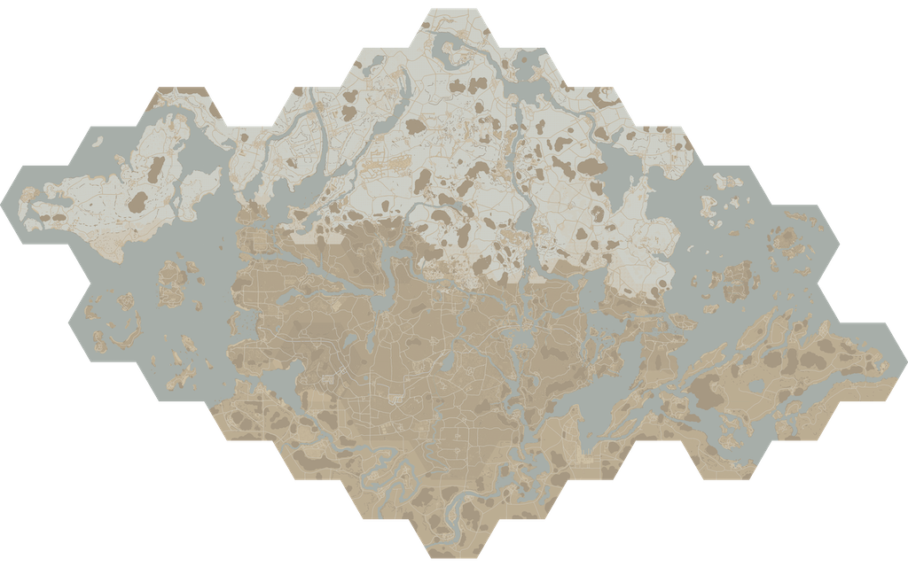
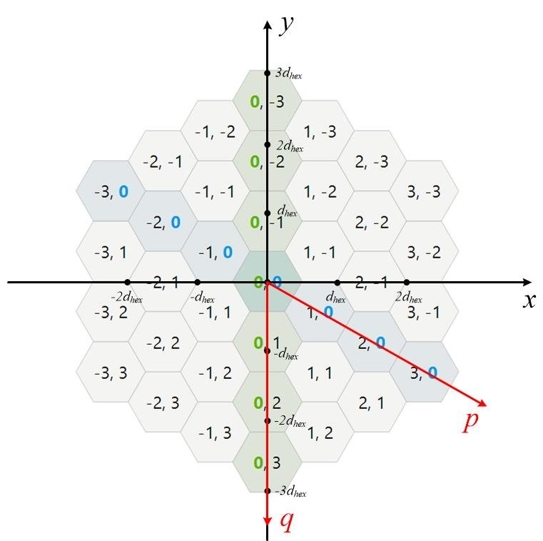

# Foxhole Hexes

Tool to help stitch and tile the Foxhole game map. Assemble all the individual hex maps into one master map, and then cut the map up into tiles that can be rendered on a map like [Leaflet](https://leafletjs.com/reference.html)



## How to run

**hex2tile**

```
Usage: hex2tile.py [OPTIONS]

Options:
  --hexes FILE         Path to config JSON with format: {<hex_id>: { 'name':
                       <hex_name>, 'file': <hex_png>, 'q': <q>, 'p': <p> } } q
                       and r are axial hexagon coordinates (legacy key 'p' is
                       still accepted)  [required]
  --out DIRECTORY      Output directory for tiles (creates z/x/y.png).
  --max-zoom INTEGER   Max zoom level (master resolution uses ppu =
                       2^maxZoom).  [default: 5]
  --min-zoom INTEGER   Min zoom level  [default: 0]
  --tile-size INTEGER  Tile size in pixels (typically 256).  [default: 256]
  --hex-size INTEGER   Width of the hex map (corner to corner) in pixels.
                       [default: 1024]
  --write-master FILE  Optional path to write the assembled master PNG for
                       debugging.
  -v, --verbose        More logging.
  --help               Show this message and exit.
```

Example:
```
python hex2tile.py --hexes hexes.json --out tiles --max-zoom 5 --min-zoom 2 --write-master master.png
```

**tga2png**

```
Usage: tga2png.py [OPTIONS]

  Convert TGA icons to PNG using Pillow.

Options:
  --from DIRECTORY              Source directory containing .tga files.
                                [required]
  --to DIRECTORY                Destination directory for .png files (created
                                if missing).  [required]
  --recursive / --no-recursive  Search for .tga files recursively under the
                                source directory.  [default: no-recursive]
  --overwrite / --no-overwrite  Overwrite existing .png files in the
                                destination directory.  [default: no-
                                overwrite]
  -h, --help                    Show this message and exit.
```

Example

```
python tga2png.py --from ../warapi/Images/Maps --to png/
```

## Hexes

The map layout is configured in a json file.

```json
{
    "TempestIslandHex": { 
        "name": "Tempest Island", "file": "pngs/MapTempestIslandHex.png", "q": -2, "p": 4 
    },
    "GreatMarchHex": { 
        "name": "Great March", "file": "pngs/MapGreatMarchHex.png", "q": 2, "p": 0 
    },
    "DeadLandsHex": { 
        "name": "DeadLandsHex", "file": "pngs/MapDeadLandsHex.png", "q": 0, "p": 0 
    },
    ...
```

The position of each hex is defined by the q,p coordinates. This axial coordinate system is based on this diagram.



Learn more about hexagon math here:
- https://math.stackexchange.com/questions/2254655/hexagon-grid-coordinate-system
- https://www.redblobgames.com/grids/hexagons/

I may have gotten some of the theory and conventions wrong in the code, but the results seem to work.
